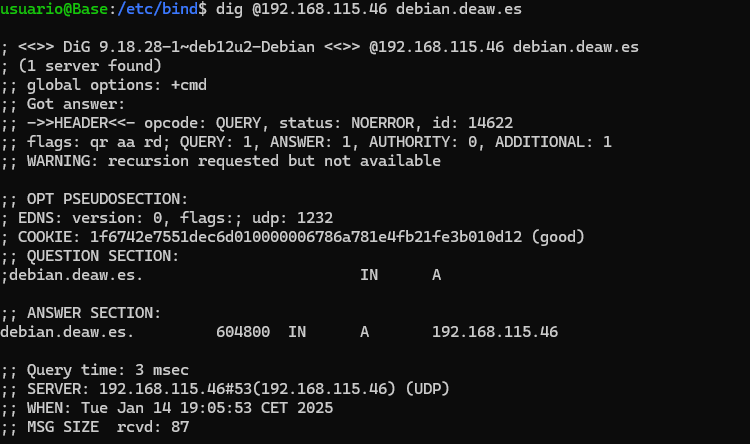

# Practica 4.1 DNS

## Instalación del servidor DNS. 
Bind es una herramienta de software libre que se distribuye con la mayoria de plataformas Unix y Linux, se le puede conocer también como named. 
Bind9 es la versión que vamos a utilizar en esta práctica. 

Primero instalaremos el servidor DNS en Debian. Para ello deberemos ejecutar el siguiente comando para instalar el paquete


## Configuración del servidor. 
En esta práctica, solo utilizaremos IPv4 y para indicarselo a Bind, editaremos su archivo de configuración general **named**. 
Primero accederemos a la ubicación del archivo 
```console
cd /etc/default
```

Y para indicarle que solo utilize IPv4, modificaremos la línea de "OPTIONS..." de la siguiente manera. 


Ahora comprobaremos el archivo de configuración inicial con el nombre de named.conf de Bind. Accederemos a su ubicación con el siguiente comando. 

```console
cd /etc/bind
```

Y al consultarlo, nos debe de salir lo siguiente: 


La función de este archivo es incluir en el todos los archivos de configuración que usaremos. 


### Configuracion *named.conf.options*
Como buena práctica que es, haremos una copia de seguridad del archivo de configuración por cada cambio que hagamos, con el siguiente comando: 


Posterior a la copia, procederemos a editarlo e incluir los siguientes contenidos.
- Para la seguridad, añadiremos una lista de acceso de forma que solo puedan hacer búsqueda recursiva aquellas ip que hayamos autorizado previamente. Para ello escribiremos lo siguiente antes del bloque options {...}. Donde la X dependerá de nuestra red. 


- COnfiguraremos el servidor para que escuche consultas DNS en el puerto 53 y en la IP de su interfaz de la red privada. Deberemos colocar la IP de la interfaz de vuestra Debian. 
- También vamos a comentar la línea que pone "listen-on-v6 {any;}" puesto que no vamos a responder a consultas tipo IPv6. 


Para comprobar si la sintaxis es correcta y no hay fallos en la configuración, lo haremos con el siguiente comando: 

```console
sudo named-checkconf
```

En el caso de no devolver nada, está todo correcto.

Ahora reiniciaremos el servidor y comprobaremos el estado.


### Configuracion *named.conf.local*
En este archivo configuraremos aspectos respecto a nuestras zonas que posteriormente crearemos. Vamos a declarar la zona "deaw.es". Aquí indicaremos que el servidor DNS es maestro para esta zona y donde esta ubicado el archivo de zona que crearemos a continuación. 


### Creación del archivo de zona. 
Ahora crearemos el archivo de zona de resolución directa justo en el directorio que previamente hemos indicado antes. Tenemos que escribir lo siguiente. 


### Creación del archivo de zona para la resolución inversa. 
Es necesario que existan ambos archivo de zona. Uno para la resolución directa y otro como su nombre indica para la inversa. Primero la inizializamos en named.conf.local. X es el tercer byte de vuestra red.


Y el siguiente archivo es el correspondiente a la configuración de la resolución inversa.


## Comprobaciones de las configuraciones. 
Para la configuración de la zona de resolución directa :


Para la configuración de la zona de resolución inversa :
Si todo está bien devolverá el Ok, en caso contrario informará de ello. 


Reiniciamos el servicio y comprobamos el estado:


Ahora desde el cliente usando dig, comprobaremos las resoluciones directas e inversas. 
**Directa**



**Inversa**


## Cuestiones Finales. 


**Cuestión 1**
¿Qué pasará si un cliente de una red diferente a la tuya intenta hacer uso de tu DNS de alguna manera, le funcionará?¿Por qué, en qué parte de la configuración puede verse?

Denpenderá del DNS, si este tiene configurado un controll de acceso desde redes específicas, el cliente no podrá acceder. Esto está configurado en el archivo named.conf.options. 

**Cuestión 2**
¿Por qué tenemos que permitir las consultas recursivas en la configuración?

Las consultas recursivas permiten que el servidos DNS busque respuestas en otros servidores en nombre del cliente, devolviendo la respuesta completa. 


**Cuestión 3**
El servidor DNS que acabáis de montar, ¿es autoritativo?¿Por qué?

Un servidor autoritativo es aquel que gestiona una zona en específica y tiene los registros necesarios configurados en sus archivos de zona. Por lo que es autoritativo. 


**Cuestión 4**
¿Dónde podemos encontrar la directiva $ORIGIN y para qué sirve?

La directiva $Originse encuentra en los archivos de zona de un servidor DNS y sirve para establecer el dominio base que se usará en los registros relativos dentro del archivo. 


**Cuestión 5**
¿Una zona es idéntico a un dominio?

No, ya que un dominio es una parte del espacio de nombres de DNS mientras que la zona es una parte del dominio gestionada por un servidor DNS. 
Vamos a poner un ejemplo con el dominio example.com. Un servidor puede gestionar la zona para example.com y otro para la zona sub.example.com. 


**Cuestión 6**
¿Pueden editarse los archivos de zona de un servidor esclavo/secundario?

No, ya que estos archivos no deben editarse directamente debido a que estos servidores obtienen las zonas desde un servidor maestro, por lo que editarlos directamente podría causar errores. 


**Cuestión 7**
¿Por qué podría querer tener más de un servidor esclavo para una misma zona?

Tener más de un servidor mejora la redundancia y la disponibilidad del servicio DNS. Esto genera alta disponibilidad, un balanceo de carga.


**Cuestión 8**
¿Cuántos servidores raíz existen?

Existen 13 servidores raíz principales en el sistema DNS, estos estan identificados de la 'A' a la 'M'. 


**Cuestión 9**
¿Qué es una consulta iterativa de referencia?

Una consulta iterativa es cuando un servidor DNS proporciona la mejor respuesta posible sin buscar en otros servidores. 


**Cuestión 10**
En una resolución inversa, ¿a qué nombre se mapearía la dirección IP 172.16.34.56?

La resolución inversa se realiza mediante registros PTR en una zona especial. La dirección dada se mapearía al nombre asociado en el archivo de zona inversa. 


<br>

## Definiciones. 
Mapear una dirección : Significa establecer una asocuacion entre una dirección y un nombre / dominio o viceversa en el contexto DNS. 

DNS: Sistema de nombres de dominio que traduce nombres legibles (como www.google.com) en direcciones IP utilizadas por las computadoras.

Consultas recursivas: Petición en la que un servidor DNS busca la respuesta completa en otros servidores en nombre del cliente.

Servidor autoritativo: Servidor DNS que tiene información oficial sobre una zona y responde con datos precisos.

Zona: Parte del espacio de nombres DNS que gestiona un servidor, incluyendo registros de uno o varios dominios.

Dominio: Nombre único dentro del sistema DNS que identifica un sitio o recurso, como example.com.

Servidores raíz: Servidores DNS principales que manejan el inicio de las consultas DNS y dirigen a otros servidores.

Consulta iterativa: Petición en la que un servidor DNS devuelve la mejor referencia conocida, sin buscar más respuestas.